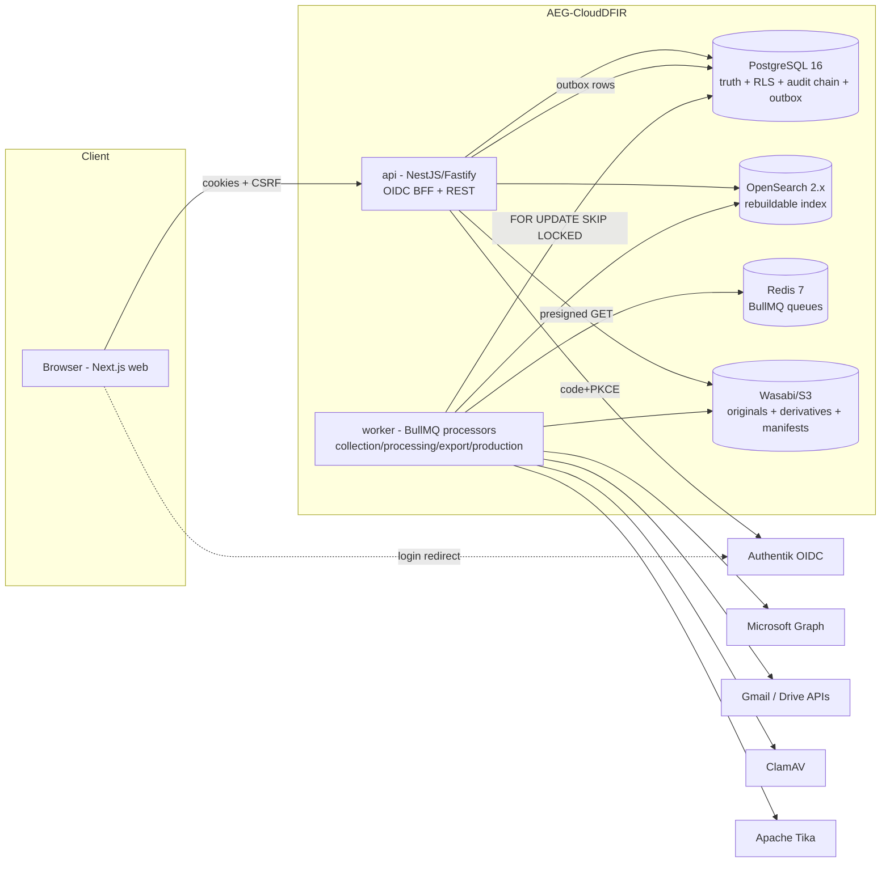
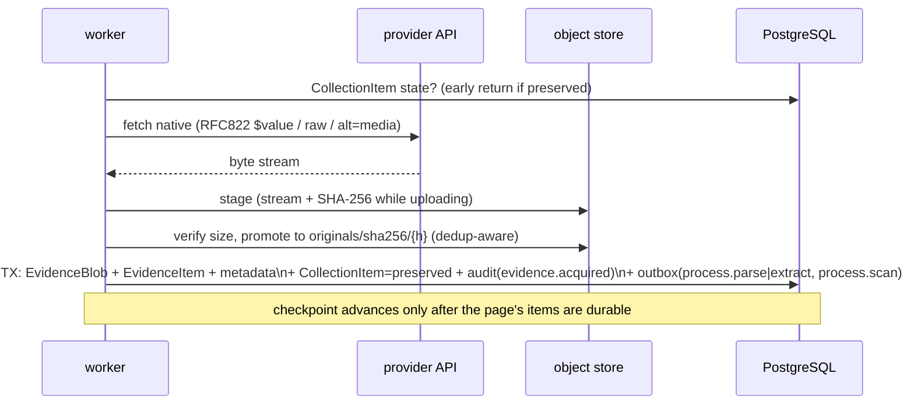
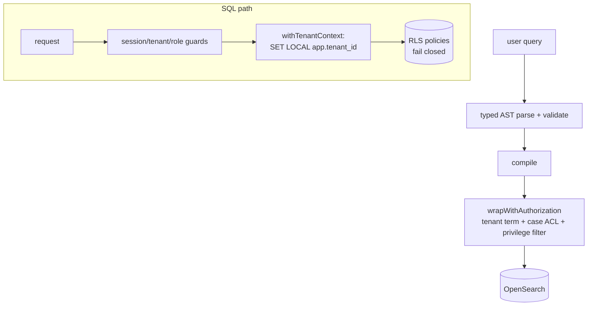
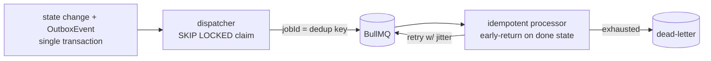

# AEG-CloudDFIR architecture

See `docs/adr/` for the decision records behind each choice.

## System context

## Evidence acquisition flow (per item)

## Tenant isolation layers

## Job reliability

Production pipeline, search compilation details, and the data model live in
the package sources; the canonical model is `packages/database/prisma/schema.prisma`.
